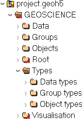

Workspace
=========

The bulk of the data is accessible both directly by ``UUID`` through the
``flat`` HDF5 groups or through a **hierarchy of hard links** structured as follow:

    As seen in `HDFView <https://support.hdfgroup.org/products/java/hdfview/>`_

:Data: Flat container for all data entities
:Groups: Flat container for all group entities
:Objects: Flat container for all object entities
:Root: Optional hard link to ``workspace`` group, top of group hierarchy.
:Types:
    - `Data Types`_: Flat container for all data types
    - `Group Types`_: Flat container for all group types
    - `Object Types`_: Flat container for all object types

.. figure:: ./images/entity_links.png
    :align: right
    :height: 400

While all groups, objects and data entities are written into their respective base
folder, they also hold links to their children entities to allow for
traversals. There is no data duplication, merely multiple references (pointers) to
the data storage on file. Types are shared (and thus generally written to file first). All
groups, objects and data must include a hard link to their type.

**Attributes**

:Version: ``double``
    Version of specification used by this file
:Distance unit: ``str`` *feet* or (default) *metres*
    Distance unit of all data enclosed
:Contributors: 1D array of ``str``
    (Optional) List of users who contributed to this workspace

Groups
======

.. figure:: ./images/groups.png
    :align: right
    :width: 300

Groups are simple container for other groups and objects. They are often used to assign
special meanings to a collection of entities or to create specialized software
functionality.

**Attributes**

:Name: ``str``
    Name of the object displayed in the project tree.
:ID: ``str``, *UUID*
    Unique identifier of the group.
:Visible: ``int``, 0 or (default) 1
    Set visible in the 3D camera (checked in the object tree).
:Public: ``int``, 0 or (default) 1
    Set accessible in the object tree and other parts of the the user interface.
:Clipping IDs: 1D array of *UUID*
    (Optional) List of unique identifiers of clipping plane objects.
:Allow delete: ``int``, 0 or (default) 1
    (Optional) User interface allows deletion.
:Allow move: ``int``, 0 or (default) 1
    (Optional) User interface allows moving to another parent group.
:Allow rename: ``int``, 0 or (default) 1
    (Optional) User interface allows renaming.
:Metadata: (``int``, optional)
    (Optional) Any additional text attached to the group.

The following section describes the supported group types.

.. toctree::
   :maxdepth: 1

   analyst/groups
   giftools/groups
   integrator/groups
   integrator/themes

.. note:: Though this file format technically allows objects/groups to appear
   within multiple groups simultaneously (overlapping lists), this is not
   currently supported by ``Geoscience ANALYST``.

Objects
=======

.. figure:: ./images/objects.png
    :align: right
    :width: 300

Objects are containers for ``Data`` with spatial information.
Most (not all) object geometry is described in terms of vertices (3D
locations) and cells (groupings of vertices such as triangles or
segments). The exact requirements and interpretation depends on the
type.

**Attributes**

:Name: ``str``
    Name of the object displayed in the project tree.
:ID: ``str``
    Unique identifier (*UUID*) of the group.
:Visible: ``int``, 0 or (default) 1
    Set visible in the 3D camera (checked in the object tree).
:Public: ``int``, 0 or (default) 1
    Set accessible in the object tree and other parts of the the user interface.
:Clipping IDs: 1D array of ``UUID``
    (Optional) List of unique identifiers of clipping plane objects.
:Allow delete: ``int``, 0 or (default) 1
    (Optional) User interface allows deletion.
:Allow move: ``int``, 0 or (default) 1
    (Optional) User interface allows moving to another parent group.
:Allow rename: ``int``, 0 or (default) 1
    (Optional) User interface allows renaming.
:Metadata: (``int``, optional)
    (Optional) Any additional text attached to the group.

The following section describes the supported object types and their specific attributes.

.. toctree::
   :maxdepth: 1

   analyst/objects
   integrator/objects

Data
====

.. figure:: ./images/data.png
    :align: right
    :width: 300

Containers for data values of various types.
Data are currently **always stored as a 1D array**, even in the case of
single-value data with the ``Object`` association (in which case it is a
1D array of length 1).
See the `Data Types`_ section for the list of supported data types.

**Attributes**

:Association: ``str``
    Describes which part the property is tied to. Must be one of:
    *Unknown*, *Object*, *Cell*, *Vertex*, *Face* or *Group*

:Name: ``str``
    Name of the data displayed in the project tree.
:ID: ``str``
    Unique identifier (*UUID*) of the group.
:Visible: ``int``, 0 or 1
    (Optional) Set visible in the 3D camera (checked in the object tree).
:Clipping IDs: 1D array of ``UUID``
    (Optional) List of unique identifiers of clipping plane objects.
:Allow delete: ``int``, 0 or (default) 1
    (Optional) User interface allows deletion.
:Allow rename: ``int``, 0 or (default) 1
    (Optional) User interface allows renaming.
:Public: ``int``, 0 or (default) 1
    (Optional) Set accessible in the object tree and other parts of the the user interface.

Types
=====

.. figure:: ./images/types.png
    :align: right
    :width: 150

While they are structured similarly, **each group, object or set of data
has a type that defines how its HDF5 datasets should be interpreted**.
This type is shared among any number of entities (groups/objects/data sets).

Group Types
-----------

**Attributes**

:Name: ``str``
    Name of the group displayed in the project tree.
:ID: ``str``
    Unique identifier (*UUID*) of the group type.
:Description: ``str``
    (Optional) Description of the type.
:Allow move contents: ``int``, 0 or (default) 1
    (Optional) User interface allows deletion of the content.
:Allow delete contents: ``int``, 0 or (default) 1
    (Optional) User interface allows deletion of the content.

Object Types
------------

Objects are containers for data values with spatial information.

**Attributes**

:Name: ``str``
    Name of the object displayed in the project tree.
:ID: ``str``
    Unique identifier (*UUID*) of the group type.
:Description: ``str``
    (Optional) Description of the type.

Data Types
----------

New data types can be created at will by software or users to describe
object or group properties. Data of the same type can exist on any
number of objects or groups of any type, and each instance can be
associated with vertices, cells or the object/group itself. Some data
type identifiers can also be reserved as a means of identifying a
specific kind of data.

**Attributes**

:Name: ``str``
    Name of the object displayed in the project tree.
:ID: ``str``
    Unique identifier (*UUID*) of the data type.

    Unlike ``Groups`` and ``Objects``, ``Data`` entities do not generally have fixed identifier ``Type``.
    Multiple data entities linked by a type will share common properties (color map, units, etc.).
    Exceptions to this rule are the fixed:

    .. toctree::
       :maxdepth: 1

       integrator/data

:Primitive type: ``str``

    Specifies the kind of data values stored as ``HDF5 dataset``. Must be one of:

    .. toctree::
       :maxdepth: 1

       analyst/data

:Description: ``str``
    (Optional) Description of the type.
:Units: ``str``
    (Optional) Data units
:Color map: 1D compound array

    [*Value* ``double``, *Red* ``uint``, *Green* ``uint``, *Blue* ``uint``, *Alpha* ``uint``]

    (Optional) Records colors assigned to value ranges. The *Value* mark the start of the range)
:Value map: (1D compound array dataset)

    [*Key* ``uint``, *Value* ``str``]

    Required only for reference data types (classifications)
:Transparent no data: ``int``, 0 or (default) 1
    (Optional) Whether or not absence of data/filtered data should be hidden in the viewport.
:Hidden: ``int``, 0 or (default) 1
    (Optional) Whether or not the data type should appear in the data type list.
:Scientific notation: ``int``, 0 or (default) 1
    (Optional) Whether or not the data values of this type should be displayed in scientific notation.
:Precision: ``int``
    (Optional) The number of decimals (or significant digits in case of scientific notation) used when displayed data values of this type.
:Number of bins: ``int``, default=50
    (Optional) Number of bins used when displaying histogram
:Duplicate type on copy: ``int``, 0 or (default) 1
    (Optional) When enabled, a separate copy of this data type will be created and used when data of this type is copied.
