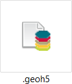

GEOH5 Format
============

About
^^^^^

The GEOH5 format aims to provide a robust means of handling large quantities
of diverse data required in geoscience. The file structure builds on the
generic qualities of the `Geoscience ANALYST
<http://www.mirageoscience.com/our-products/software-product/geoscience-analyst>`_
data model, and attempts to maintain a certain level of simplicity and
consistency throughout. It is based entirely on free and open `HDF5 technology
<https://support.hdfgroup.org/documentation/index.html>`__.
Given that this specification is public, the
file format could, with further investment and involvement, become a useful
exchange format for the broader geoscientific community.

Why GEOH5?
----------

- Leverages properties of HDF5.
   Fast I/O, compression, cross-platform

- Content readable and writeable by third party software.
   We recommend using `HDFView <https://support.hdfgroup.org/downloads/index.html>`__, along with Geoscience ANALYST, when
   learning the format.

- Easily extensible to new data types.
   It is intended for Geoscience ANALYST to preserve data it does not
   understand (and generally be very tolerant with regards to missing
   information) when loading and saving geoh5 files. This will allow third
   parties to write to this format fairly easily, as well as include
   additional information not included in this spec for their own purposes. In the current implementation,
   Geoscience ANALYST automatically removes unnecessary information on save.

Standards
^^^^^^^^^

General notes on formatting.

    -  All text data and attributes are variable-length and use UTF-8 encoding
    -  All numeric data uses INTEL PC native types
    -  Boolean values are stored using char (0:false, 1:true)
    -  Anything found in a geoh5 v1.0 file which is not mentioned in this document is optional information

External Links
^^^^^^^^^^^^^^

-  `HDFView <https://portal.hdfgroup.org/display/HDFVIEW/HDFView>`_.
-  `Precompiled binaries for multiple platforms <https://www.hdfgroup.org/products/java/release/download.html>`_
- Libraries for accessing HDF5 data
   -  `C, C, .NET <https://www.hdfgroup.org/downloads/>`_
   -  `Python <http://www.h5py.org/>`_
   -  `Matlab <http://www.mathworks.com/help/matlab/hdf5-files.html>`_
