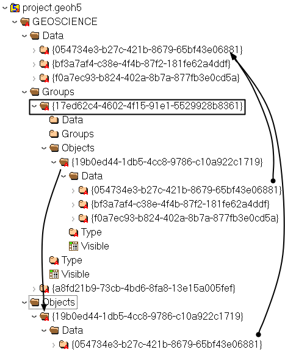

Workspace
=========

The workspace is the top-level container for all data in the file.

**Attributes**

:Version: ``double``
    Version of specification used by this file
:Distance unit: ``str`` *feet* or (default) *metres*
    Distance unit of all data enclosed
:Contributors: 1D array of ``str``
    (Optional) List of users who contributed to this workspace

The bulk of the data is accessible both directly by ``UUID`` through the
``flat`` HDF5 groups or through a **hierarchy of hard links** structured as follow:

:Data: Flat container for all data entities
:Groups: Flat container for all group entities
:Objects: Flat container for all object entities
:Root: Optional hard link to ``workspace`` group, top of group hierarchy.
:Types:
    - :ref:`Data Types <data_types>`: Flat container for all data types
    - :ref:`Group Types <group_types>`: Flat container for all group types
    - :ref:`Object Types <object_types>`: Flat container for all object types

.. figure:: ./images/hierarchy.png
    :align: center
    :height: 200

    As seen in `HDFView <https://support.hdfgroup.org/products/java/hdfview/>`_

While all groups, objects and data entities are written into their respective base
folder, they also hold links to their children entities to allow for
traversals. There is no data duplication, merely multiple references (pointers) to
the data storage on file. Types are shared (and thus generally written to file first). All
groups, objects and data must include a hard link to their type.

