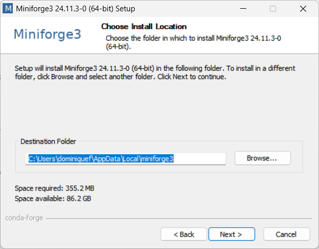

Installation
============

**geoh5py** is currently written for Python 3.6 or higher, and depends on `NumPy <https://numpy.org/>`_ and
`h5py <https://www.h5py.org/>`_. Users will likely want to also make use of advanced processing
techniques made available under the python ecosystem. We therefore recommend installing
Anaconda to handle the various packages.

Step 1- Setup Anaconda
----------------------
`Download and install Anaconda <https://www.anaconda.com/download/>`_

Step 2: Install **geoh5py**
---------------------------

From an Anaconda Prompt, install **geoh5py** from PyPI::

    $ pip install geoh5py

To install the latest development version of **geoh5py**, you can use pip with the
latest GitHub master::

    $ pip install git+https://github.com/MiraGeoscience/geoh5py.git

To work with **geoh5py** source code in development, install from GitHub::

    $ git clone --recursive https://github.com/MiraGeoscience/geoh5py.git
    $ cd geoh5py
    $ python setup.py install
