.. _parameter_types:

Forms
=====

The following sections describe the different types of parameters that can be used in the **ui.json** format.

.. _bool_param:

Boolean Parameter
-----------------

A parameter named "input" that has a ``bool`` value.

.. code-block:: json

   {
   "input":{
   "main": true,
   "label": "Do you like Python?",
   "value": true,
   "tooltip": "Check if you like Python"
   }
   }

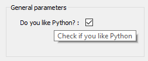

Integer Parameter
-----------------

A parameter that has an ``int`` value. The optional parameters ``min`` and ``max`` invoke a validator to insure the bound(s) are enforced.

.. code-block:: json

   {
   "file_xp":{
   "main": true,
   "label": "Number of ui.json files have you created",
   "value": 1,
   "min": 0,
   "max": 100
   }
   }

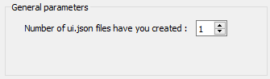

Float Parameter
---------------

A parameter that has a ``float`` value. The optional parameters are:

min ``float``
    Minimum value allowed for validator of the **value** member. The default is the minimum numeric limits of float.
max ``float``
    Maximum value allowed for validator of the **value** member. The default is the maximum numeric limits of float.
lineEdit ``bool``
    Boolean whether to use a line edit (**true**) or a spin box (**false**). The default is true.
precision ``int``
    Number of decimal places in the line edit or spin box

.. code-block:: json

   {
   "avocado": {
   "main": true,
   "label": "Cost per avocado ($)",
   "value": 0.99,
   "min": 0.29,
   "precision": 2,
   "lineEdit": false,
   "max": 2.79
   }
   }

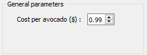

String Parameter
----------------

For a simple string parameter, use an empty ``str`` value to have an empty string. Only a ``label`` and ``value`` is required.

.. code-block:: json

   {
   "my_string": {
   "main": true,
   "label": "Name",
   "value": "Default answer"
   }
   }

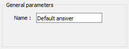

Radio Label Parameter
----------------------

If both ``originalLabel`` and ``alternateLabel`` members are added to a string parameters, the dialog will render a
two-choice radio button.  The ``value`` will reflect the current choice and all containing one of the selections will be
updated with the choide of the radio button.

.. code-block:: json

   {
   "model_type": {
   "main": true,
   "label": "Model type",
   "originalLabel": "Conductivity",
   "alternateLabel": "Resistivity",
   "value": "Conductivity",
   "enabled": true
   },
   "conductivity_model": {
   "main": true,
   "label": "Conductivity model",
   "value": 0.1
   }
   }

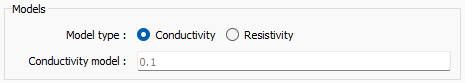

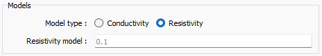

Multi-choice string Parameter
-----------------------------

For a dropdown selection, add a ``choiceList`` member with an array of strings (``str``). A **multiSelect** member is
available to allow selecting more than one value from the dropdown.  If **multiSelect** is true, the value member would be
an array of the choiceList values selected by the user.

.. code-block:: json

   {
   "favourites":
   {
   "choiceList": ["Northwest Territories",
   "Yukon",
   "Nunavut"],
   "main": true,
   "multiSelect": false,
   "label": "Favourite Canadian territory",
   "value": "Yukon"
   }
   }

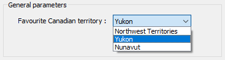

File Parameter
--------------

A file parameter comes with an icon to choose the file, with a ``str`` value. Extra members of the file object parameter are **fileDescription** and **fileType**. Both of these are ``str`` types and can be arrays, but must be of the same length

.. code-block:: json

   {
   "model_file": {
   "fileDescription": ["Chargeability", "Conductivity"],
   "fileType": ["chg", "con"],
   "main": true,
   "label": "DC/IP model file",
   "value": ""
   }
   }

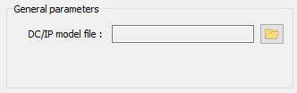

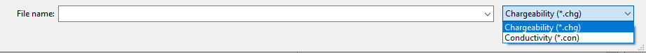

Group Parameter
---------------

The group parameter can be used to select groups within ANALYST.  The **groupType** member is required and must be either
a single type `UUID (universally unique identifier) <https://en.wikipedia.org/wiki/Universally_unique_identifier>`_
string of a geoh5py group, or a list of type uuids.

.. code-block:: json

   {
   "my_group": {
   "groupType": [
      "{61fbb4e8-a480-11e3-8d5a-2776bdf4f982}",
      "{55ed3daf-c192-4d4b-a439-60fa987fe2b8}"
    ],
   "main": true,
   "multiSelect": false,
   "label": "Select Points or Curve",
   "value": ""
   }
   }

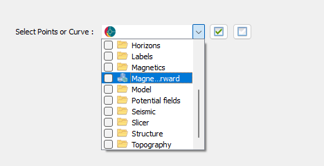

Drillhole group data Parameter
------------------------------

The Drillhole group data parameter allows users to select a drillhole group and one or more data channels from the group.
The **groupType** and **groupValue** members are required and gives the type uuid of the drillhole group and selected
drillhole group, respectively.

.. code-block:: json

    {
    "my_group_data": {
        "main": true,
        "label": "Choose a drillhole group and data",
        "groupType": "{825424fb-c2c6-4fea-9f2b-6cd00023d393}",
        "groupValue": "",
        "multiselect": true,
        "value": ""
      }
    }

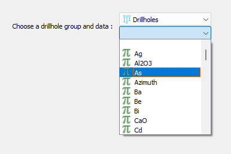

.. _object_parameter:

Geoscience ANALYST Object Parameter
-----------------------------------

The object parameter allows users to select geoh5py objects from a dropdown in ANALYST.  The **meshType** member is
required to filter the :ref:`Object Type <object_types>` available in the dropdown.  It is provided as a single type
uuid or an array of uuids. A **multiSelect** member is available to allow selecting more than one object. The value
returned is the uuid of the ANALYST object selected, or an array of uuids if many have been selected with the
**multiSelect** option.

.. code-block:: json

   {
   "interesting_object": {
   "meshType": ["{202C5DB1-A56D-4004-9CAD-BAAFD8899406}" ,
      "{6A057FDC-B355-11E3-95BE-FD84A7FFCB88}"],
   "main": true,
   "multiSelect": false,
   "label": "Select Points or Curve",
   "value": ""
   }
   }

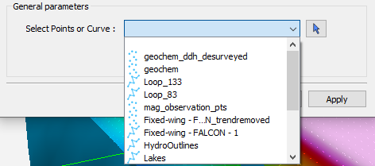

.. _data_parameter:

Geoscience ANALYST Data parameter
---------------------------------

Creating a parameter to choose a Geoscience ANALYST object's data requires extra members:

dataType ``str``
   Describes the type of data to filter. One or more (as an array) of these key words: ``Integer``, ``Float``, ``Text``,
   ``Referenced``, ``Vector``, ``DataTime``, ``Geometric``, ``Boolean``, or ``Text``.
dataGroupType (optional) ``str``
   To allow choosing a data group, the user can replace the **dataType** member with the **dataGroupType** and provide a
   single or array of the following strings ``3D vector``, ``Dip direction & dip``, ``Strike & dip``, or ``Multi-element``.
association ``str``
   Describes the geometry of the data. One or more of these key words: ``Vertex``, ``Cell``, or ``Face``.
parent ``str``
   Either a *UUID* of the parent or the name of the :ref:`Object parameter <object_parameter>` JSON object to allow the
   user to choose the mesh.
isValue ``bool``
   Describes whether to read the **value** (``float``) or **property** (``str``) member. If not given, the value member
   is an *UUID* and is considered a *drop-down data parameter*. If this member is given along with **property**, then an icon is added to the UI element, which switches between the **value** (line edit) and **property** (drop-down) choices. This value is updated on export depending on the style choice (``float`` or ``str``)
property ``str``
   Data *UUID*  that is selected when **isValue** is present.  Geoscience ANALYST Pro will update this value on export.
min ``float``
    Optional minimum value allowed for validator of the **value** member. The default is the minimum numeric limits of float.
max ``float``
    Optional maximum value allowed for validator of the **value** member. The default is the maximum numeric limits of float.
precision ``int``
    Optional number of decimal places for the value.

Drop-down Parameter
-------------------
In this example, the object parameter *data_mesh* is also given for reference.

.. code-block:: json

   {
   "data_mesh": {
   "main": true,
   "group": "Models",
    "meshType": ["{202C5DB1-A56D-4004-9CAD-BAAFD8899406}" ,
      "{6A057FDC-B355-11E3-95BE-FD84A7FFCB88}"],
   "main": true,
   "label": "Select Points or Curve",
   "value": ""
   },
   "data_channel": {
   "main": true,
   "group": "Models",
   "association": "Vertex",
   "dataType": "Float",
   "label": "Data channel",
   "parent": "data_mesh",
   "value": ""
   }
   }

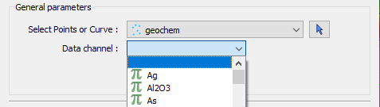

Data or value Parameter
-----------------------
In some cases, a parameter may take its data from a Geoscience ANALYST object or simply a ``float`` value. The use of
the member **isValue** and **property** together allows for the UI to switch between these two cases. In the top image,
the **isValue** is true, so the **value** member of 1.0 will initially be active. When the icon is clicked, the type of
input is switched to the **property** member (bottom image). The **uncertainty channel** object also depends on the
**data_mesh** object. The drop-down selection will filter data from the chosen object that is located on the vertices
and is float. The **isValue** is set to false upon export in this case.

.. code-block:: json

   {
   "data_mesh": {
   "main": true,
    "meshType": ["{202C5DB1-A56D-4004-9CAD-BAAFD8899406}" ,
      "{6A057FDC-B355-11E3-95BE-FD84A7FFCB88}"],
   "main": true,
   "label": "Select Points or Curve",
   "value": ""
   },
   "uncertainty_channel": {
   "main": true,
   "association": "Vertex",
   "dataType": "Float",
   "isValue": true,
   "property": "",
   "min": 0.001,
   "label": "Uncertainty",
   "parent": "data_mesh",
   "value": 1.0
   }
   }

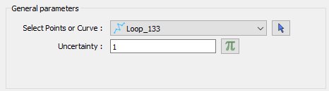
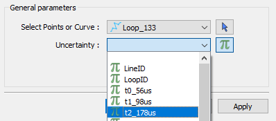

Range slider Parameter
-----------------------

The range slider parameter allows users to select a data channel and select a range of values from within the data bounds.
Compared to the data or value parameter, the range slider parameter adds the required **rangeLabel**, **allowComplement**
and **isComplement** members.  If allowComplement is true, the user may flip the inclusion from within the bounds to outside
the bounds, and when it is false the icon for flipping the complement is grey and inactive.  When saved the ui.json file
will have it's **isComplement**, **property** and **value** updated.  The **property** will contain the uuid to the selected
data, whereas the **value** will contain the range values.  If is complement is false, then the data are intended to be
included within the bounds, and if it is false they are meant to be included outside the bounds.

.. code-block:: json

    {
      "my_object": {
        "main": true,
        "label": "An object",
        "meshType": "{4ea87376-3ece-438b-bf12-3479733ded46}",
        "value": ""
      },
      "range_data": {
        "main": true,
        "label": "Select range",
        "allowComplement": true,
        "isComplement": false,
        "parent": "my_object",
        "property": "",
        "association": "Cell",
        "dataType": "Float",
        "value": 0.0,
        "rangeLabel": "My range"
      }
    }

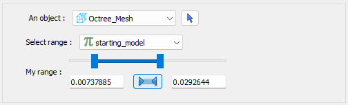
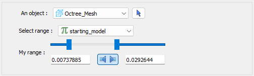

Dependencies on other parameters
--------------------------------

Use the **dependency** and **dependencyType** members to create dependencies. The parameter driving the dependency should set **optional** to true or be a :ref:`Boolean parameter'<bool_param>`. Below are a couple of examples. The first initializes the *favourite_package* parameter as disabled until the *python_interest* parameter is checked. The second shows the opposite when the **enabled** member is set to true.

.. code-block:: json

   {
   "python_interest": {
   "main": true,
   "label": "Do you like Python?",
   "value": false,
   "tooltip": "Check if you like Python"
   },
   "favourite_package": {
   "main": true,
   "label": "Favourite Python package",
   "value": "geoh5py",
   "dependency": "python_interest",
   "dependencyType": "enabled"
   }
   }

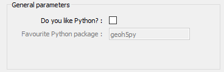

The next example has a dependency on an optional parameter. The **enabled** member is set to false so that it is not automatically checked. The *city* and *territory* parameters will be enabled when the *territory* checkbox is checked.

.. code-block:: json

   {
   "territory": {
   "choiceList": ["Northwest Territories",
   "Yukon",
   "Nunavut"],
   "main": true,
   "label": "Favourite Canadian territory",
   "value": "Yukon",
   "optional": true,
   "enabled": false
   },
   "city": {
   "main": true,
   "choiceList": ["Yellowknife",
   "Whitehorse",
   "Iqaluit"],
   "label": "Favourite capital",
   "value": "",
   "dependency": "territory",
   "dependencyType": "enabled"
   }
   }

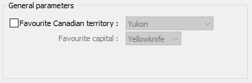
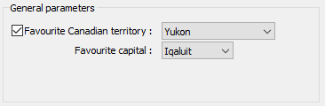
