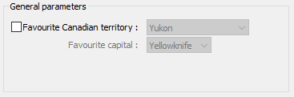
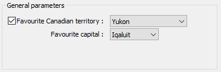

.. _parameter_types:

Forms
=====

The following sections describe the different types of forms that can be used in the **ui.json** format.

Core fields
-----------

At a minimum, a parameter must have the following **fields**:

"label" ``str``
    Name of the field displayed in the UI.

"value"
    The value of the parameter. The type of the value is determined by the form type as described in the following sections.

Optional fields
^^^^^^^^^^^^^^^

The following optional fields can be used to customize the UI. These fields are available for all parameter types unless otherwise specified.

"main" ``bool``
    Boolean whether the parameter is a main parameter (**true**) or as optional (**false**). The default is false.
"tooltip" ``str``
    A string that describes the parameter. This is displayed when the user hovers over the parameter in the UI.
"enabled" ``bool``
    Boolean whether the parameter is enabled (**true**) or disabled (**false**). The default is true.
"optional" ``bool``
    Boolean whether the parameter is optional (**true**) or required (**false**). The default is false. A checkbox is displayed in the UI to allow the user to select whether to use the parameter or not.

See the `Form dependencies`_ section for additional inter-form customization.

.. _bool_param:

Boolean form
------------

A parameter named "input" that has a ``bool`` value.

.. code-block:: json

   {
       "input":{
           "main": true,
           "label": "Do you like Python?",
           "value": true,
           "tooltip": "Check if you like Python"
       }
   }

.. figure:: ./images/bool_param.png
    :width: 400

Integer form
------------

A parameter that has an ``int`` value. The optional parameters are:

"min" ``int``
    Minimum value allowed for validator of the **value** member.
"max" ``int``
    Maximum value allowed for validator of the **value** member.

.. code-block:: json

   {
       "file_number":{
           "main": true,
           "label": "File UI",
           "value": 1,
           "min": 0,
           "max": 100
       }
   }

.. figure:: ./images/int_param.png
    :width: 400

Float form
----------

A parameter that has a ``float`` value. The optional parameters are:

"min" ``float``
    Minimum value allowed for validator of the **value** member. The default is the minimum numeric limits of float.
"max" ``float``
    Maximum value allowed for validator of the **value** member. The default is the maximum numeric limits of float.
"lineEdit" ``bool``
    Boolean whether to use a line edit (**true**) or a spin box (**false**). The default is true.
"precision" ``int``
    Number of decimal places in the line edit or spin box

.. code-block:: json

   {
       "avocado": {
           "main": true,
           "label": "Cost per avocado ($)",
           "value": 0.99,
           "min": 0.29,
           "precision": 2,
           "lineEdit": false,
           "max": 2.79
       }
   }

.. figure:: ./images/float_param.png
    :width: 400

String form
-----------

For a simple string parameter, use an empty ``str`` value to have an empty string. The optional parameters are:

"textBox": ``bool``,
    Boolean whether to use a text box (**true**) or a line edit (**false**). The default is false.

.. code-block:: json

   {
        "my_string": {
            "main": true,
            "label": "Name",
            "value": "Default answer",
            "textBox": true
       }
   }

.. figure:: ./images/str_param.png
    :width: 400

Radio Label form
----------------

Radio label parameters allow for a two-choice radio button with label choices. Any **label** value in the subsequent forms that matches ``value`` will change on selection. The optional parameters are:

"originalLabel" ``str``
    First label for the radio button.

"alternateLabel" ``str``
    Second label for the radio button.

"value" ``str``
    String matching one of the original or alternate label.

.. code-block:: json

    {
        "model_type": {
            "main": true,
            "group": "Models",
            "label": "Model type",
            "originalLabel": "Conductivity",
            "alternateLabel": "Resistivity",
            "value": "Conductivity",
            "enabled": true
        },
        "conductivity_model": {
            "main": true,
            "group": "Models",
            "label": "Conductivity model",
            "value": 0.1
        }
    }

.. figure:: ./images/radio_label_param_before.png
    :width: 400

.. figure:: ./images/radio_label_param_after.png
    :width: 400

Multi-choice string form
------------------------

For a dropdown selection of choice list.

"choiceList" ``str``
    A list of strings to choose from in the dropdown.

"multiSelect" ``bool``
    A boolean to allow for multi-selection.

.. code-block:: json

    {
        "favourites": {
            "choiceList": [
                "Northwest Territories",
                "Yukon",
                "Nunavut"
            ],
            "main": true,
            "multiSelect": false,
            "label": "Favourite Canadian territory",
            "value": "Yukon"
        }
    }

.. figure:: ./images/choice_list_param.png
    :width: 400

File form
---------

A file parameter comes with an icon to choose the file, with a ``str`` value.

"fileDescription"  ``str``
    Describes the type of file to filter.

"fileType" ``str``
    File extension to filter from. If multiple file types are given, the user will be able to select from a dropdown of the
    file types.

.. code-block:: json

    {
        "model_file": {
            "fileDescription": ["Chargeability", "Conductivity"],
            "fileType": ["chg", "con"],
            "main": true,
            "label": "DC/IP model file",
            "value": ""
        }
    }

.. figure:: ./images/file_param.png

.. figure:: ./images/file_choice.png

Group form
----------

The group parameter can be used to select groups within ANALYST.  The **groupType** member is required and must be either
a single type `UUID (universally unique identifier) <https://en.wikipedia.org/wiki/Universally_unique_identifier>`_
string of a geoh5py group, or a list of type uuids.

.. code-block:: json

    {
        "my_group": {
            "groupType": [
              "{61fbb4e8-a480-11e3-8d5a-2776bdf4f982}",
              "{55ed3daf-c192-4d4b-a439-60fa987fe2b8}"
            ],
            "main": true,
            "multiSelect": false,
            "label": "Select Points or Curve",
            "value": ""
        }
    }

.. figure:: ./images/group_param.png

Drillhole Group data form
-------------------------

The Drillhole group data parameter allows users to select a drillhole group and one or more data channels from the group.

**groupType** ``uuid``
   Required type uuid of the drillhole group.

**groupValue** ``str``
    Name of the data group to filter data names from.

.. code-block:: json

    {
        "my_group_data": {
            "main": true,
            "label": "Choose a drillhole group and data",
            "groupType": "{825424fb-c2c6-4fea-9f2b-6cd00023d393}",
            "groupValue": "",
            "multiselect": true,
            "value": ""
        }
    }

.. figure:: ./images/drillhole_group_data_param.png

.. _object_parameter:

Object form
-----------

The object parameter allows users to select geoh5py objects from a dropdown in ANALYST.  The **meshType** member is required to filter the :ref:`Object Type <object_types>` available in the dropdown.  It is provided as a single type uuid, an array of uuids or by name. A **multiSelect** member is available to allow selecting more than one object. The value returned is the uuid of the ANALYST object selected, or an array of uuids if many have been selected with the **multiSelect** option. A complete list of UUID's for geoh5 object types are available in the :ref:`geoh5 objects<geoh5_objects>` documentation page

.. code-block:: json

    {
        "interesting_object": {
            "meshType": [
                "Points",
                "Curve"
            ],
            "main": true,
            "multiSelect": false,
            "label": "Select Points or Curve",
            "value": ""
        }
    }

.. figure:: ./images/object_param.png

.. _data_parameter:

Data form
---------

Data selector from a parent object:

"dataType" ``str``
   Describes the type of data to filter. One or more (as an array) of these key words: ``Integer``, ``Float``, ``Text``,
   ``Referenced``, ``Vector``, ``DataTime``, ``Geometric`` or ``Boolean``.
"dataGroupType" (optional) ``str``
   To allow choosing a data group, the user can replace the **dataType** member with the **dataGroupType** and provide a
   single or array of the following strings ``3D vector``, ``Dip direction & dip``, ``Strike & dip``, or ``Multi-element``.
"association" ``str``
   Describes the geometry of the data. One or more of these key words: ``Vertex``, ``Cell``, or ``Face``.
"parent" ``str``
   Name of the parent Object form (:ref:`Object parameter <object_parameter>`) to filter a list of data from.

.. code-block:: json

    {
        "data_mesh": {
            "main": true,
            "meshType": [
                "{202C5DB1-A56D-4004-9CAD-BAAFD8899406}",
                "{6A057FDC-B355-11E3-95BE-FD84A7FFCB88}"
            ],
            "main": true,
            "label": "Select Points or Curve",
            "value": ""
        },
        "data_channel": {
            "main": true,
            "association": "Vertex",
            "dataType": "Float",
            "label": "Data channel",
            "parent": "data_mesh",
            "value": ""
        }
    }

.. figure:: ./images/data_param.png

Data or value form
------------------
In some cases, a parameter may take its data from a object or simply a ``float`` value. The use of the member **isValue** and **property** together allows for the UI to switch between these two cases. In the top image, the **isValue** is true, so the **value** member of 1.0 will initially be active. When the icon is clicked, the type of input is switched to the **property** member (bottom image). The **uncertainty channel** object also depends on the **data_mesh** object. The drop-down selection will filter data from the chosen object that is located on the vertices and is float. The **isValue** is set to false upon export in this case.

.. code-block:: json

    {
        "data_mesh": {
        "main": true,
        "meshType": [
                "{202C5DB1-A56D-4004-9CAD-BAAFD8899406}",
                "{6A057FDC-B355-11E3-95BE-FD84A7FFCB88}"
            ],
            "main": true,
            "label": "Select Points or Curve",
            "value": ""
        },
        "uncertainty_channel": {
            "main": true,
            "association": "Vertex",
            "dataType": "Float",
            "isValue": true,
            "property": "",
            "min": 0.001,
            "label": "Uncertainty",
            "parent": "data_mesh",
            "value": 1.0
        }
    }

.. figure:: ./images/data_value_param.png
.. figure:: ./images/data_value_param2.png

Range slider form
-----------------

The range slider parameter allows users to select a data channel and select a range of values from within the data bounds. Compared to the data or value parameter, the range slider parameter adds the required **rangeLabel**, **allowComplement** and **isComplement** members.  If allowComplement is true, the user may flip the inclusion from within the bounds to outside the bounds, and when it is false the icon for flipping the complement is grey and inactive.  When saved the ui.json file will have its **isComplement**, **property** and **value** updated.  The **property** will contain the uuid to the selected data, whereas the **value** will contain the range values.  If is complement is false, then the data are intended to be included within the bounds, and if it is false they are meant to be included outside the bounds.

.. code-block:: json

    {
        "my_object": {
            "main": true,
            "label": "An object",
            "meshType": "{4ea87376-3ece-438b-bf12-3479733ded46}",
            "value": ""
        },
        "range_data": {
            "main": true,
            "label": "Select range",
            "allowComplement": true,
            "isComplement": false,
            "parent": "my_object",
            "property": "",
            "association": "Cell",
            "dataType": "Float",
            "value": 0.0,
            "rangeLabel": "My range"
        }
    }

.. figure:: ./images/range_slider_param.png
.. figure:: ./images/range_slider_param_complement.png

Form dependencies
-----------------

"group" ``str``
    Grouped ui elements will be rendered within a box labelled with the group name.
"group_optional" ``bool``
    If True, ui group is rendered with a checkbox that controls the enabled state of all of the groups members

Dependencies on other parameters
^^^^^^^^^^^^^^^^^^^^^^^^^^^^^^^^

Use the **dependency** and **dependencyType** members to create dependencies. The parameter driving the dependency should set **optional** to true or be a :ref:`Boolean parameter'<bool_param>`. Below are a couple of examples. The first initializes the *favourite_package* parameter as disabled until the *python_interest* parameter is checked. The second shows the opposite when the **enabled** member is set to true.

"dependency" ``str``
    Name of parameter that controls the enabled or visible state of the ui element.
"dependency_type" ``str``
    Either ``enabled`` or ``visible``.
    Controls whether the ui element is enabled or visible when the dependency is enabled if optional or True if a bool type.

.. code-block:: json

   {
   "python_interest": {
   "main": true,
   "label": "Do you like Python?",
   "value": false,
   "tooltip": "Check if you like Python"
   },
   "favourite_package": {
   "main": true,
   "label": "Favourite Python package",
   "value": "geoh5py",
   "dependency": "python_interest",
   "dependencyType": "enabled"
   }
   }

.. figure:: ./images/dependency_ex1.png

The next example has a dependency on an optional parameter. The **enabled** member is set to false so that it is not automatically checked. The *city* and *territory* parameters will be enabled when the *territory* checkbox is checked.

.. code-block:: json

   {
   "territory": {
   "choiceList": ["Northwest Territories",
   "Yukon",
   "Nunavut"],
   "main": true,
   "label": "Favourite Canadian territory",
   "value": "Yukon",
   "optional": true,
   "enabled": false
   },
   "city": {
   "main": true,
   "choiceList": ["Yellowknife",
   "Whitehorse",
   "Iqaluit"],
   "label": "Favourite capital",
   "value": "",
   "dependency": "territory",
   "dependencyType": "enabled"
   }
   }

"group_dependency" ``str``
    Name of the group that controls the enabled or visible state of the ui group.
"group_dependency_type" ``str``
    Controls whether the ui group is enabled or visible when the group dependency is enabled if optional or True if a bool type.
"placeholder_text" ``str``
    Text displayed in ui element when no data has been provided.
"visible" ``bool``
    Whether the form is displayed
