.. _form_types:

Forms
=====

The following sections describe the core options and various form types that can be used in the **ui.json** format.

.. figure:: ./images/example_form.png
    :width: 400

    Example of an :ref:`Integer form <integer_form>` with optional fields.

.. code-block:: json

   {
        "input_form": {
            "label": "Input",
            "value": 1,
            "main": true,
            "tooltip": "My message to the user",
            "optional": true,
            "enabled": true,
            "visible": true
       }
   }

Base form
---------

At a minimum, a form must have the following fields:

"label" ``str``
    Name of the form displayed in the UI.

"value" ``varies``
    The input value stored by the form. The form style determines the type of the value stored.

Optional fields
^^^^^^^^^^^^^^^

The following optional fields can be used to customize the UI. These fields are available for all parameter types unless otherwise specified.

"main" ``bool``
    Boolean whether the parameter shows in the (**true**) ``General parameters`` or (**false**) ``Advanced parameters`` tabs. The default is false.
"tooltip" ``str``
    A string that describes the parameter. This is displayed when the user hovers over the parameter in the UI.
"enabled" ``bool``
    Boolean whether the parameter is enabled (**true**) or disabled (**false**). The default is true.
"optional" ``bool``
    Boolean whether the parameter is optional (**true**) or required (**false**). The default is false. A checkbox is displayed in the UI to allow the user to select whether to use the parameter or not.
"visible" ``bool``
    Whether the form is displayed

See the `Form dependencies`_ section for additional inter-form customization.

.. _bool_param:

Boolean form
------------

A ``Boolean form`` holds a ``bool`` value (true or false), rendered as a checkbox option.

.. code-block:: json

   {
       "input":{
           "label": "Do you like Python?",
           "value": true,
           "tooltip": "Check if you like Python"
       }
   }

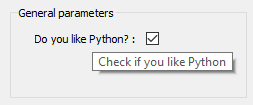

.. _integer_form:

Integer form
------------

A parameter that has an ``int`` value type. The optional parameters are:

"min" ``int``
    Minimum value allowed for validator of the **value** member.
"max" ``int``
    Maximum value allowed for validator of the **value** member.

.. code-block:: json

   {
       "file_number":{
           "label": "File UI",
           "value": 1,
           "min": 0,
           "max": 100
       }
   }

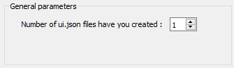

Float form
----------

A parameter that has a ``float`` value. The optional parameters are:

"min" ``float``
    Minimum value allowed for validator of the **value** member. The default is the minimum numeric limits of float.
"max" ``float``
    Maximum value allowed for validator of the **value** member. The default is the maximum numeric limits of float.
"lineEdit" ``bool``
    Boolean whether to use a line edit (**true**) or a spin box (**false**). The default is true.
"precision" ``int``
    Number of decimal places in the line edit or spin box

.. code-block:: json

   {
       "avocado": {
           "label": "Cost per avocado ($)",
           "value": 0.99,
           "lineEdit": false,
           "min": 0.29,
           "max": 2.79,
           "precision": 2
       }
   }

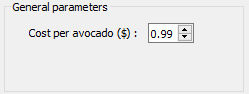

String form
-----------

For a simple string parameter, use an empty ``str`` value to have an empty string. The optional parameters are:

"textBox": ``bool``,
    Boolean whether to use a text box (**true**) or a line edit (**false**). The default is false.

.. code-block:: json

   {
        "my_string": {
            "label": "Name",
            "value": "Default answer",
            "textBox": true
       }
   }

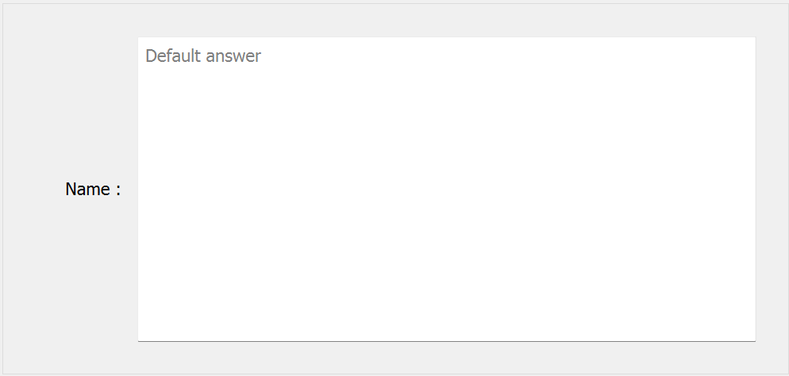

.. _label_form:

Label form
----------

A ``Label form`` is a text label that can be used to display information to the user. Contrairy to other form types, the ``value`` field must be set to ``null``. Optional fields include

"icon" ``str``
    A string that describes the icon to display next to the label. The default is no icon. The following icons are available: ``warning``, ``information``, ``critical``, ``question``.

.. code-block:: json

    {
        "my_label": {
            "main": true,
            "label": "Do not forget!",
            "value": null,
            "icon": "warning"
        }
    }

.. figure:: ./images/label_form.png
    :width: 400

Radio label form
----------------

Radio label parameters allow for a two-choice radio button with label choices. Any **label** value in the subsequent forms that matches ``value`` will change on selection. The optional parameters are:

"originalLabel" ``str``
    First label for the radio button.

"alternateLabel" ``str``
    Second label for the radio button.

"value" ``str``
    String matching one of the original or alternate label.

.. code-block:: json

    {
        "model_type": {
            "group": "Models",
            "label": "Model type",
            "originalLabel": "Conductivity",
            "alternateLabel": "Resistivity",
            "value": "Conductivity",
            "enabled": true
        },
        "conductivity_model": {
            "group": "Models",
            "label": "Conductivity model",
            "value": 0.1
        }
    }

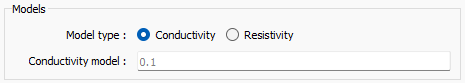

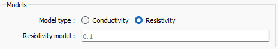

Multi-choice string form
------------------------

For a dropdown selection of choice list.

"choiceList" ``str``
    A list of strings to choose from in the dropdown.

"multiSelect" ``bool``
    A boolean to allow for multi-selection.

.. code-block:: json

    {
        "favourites": {
            "choiceList": [
                "Northwest Territories",
                "Yukon",
                "Nunavut"
            ],
            "multiSelect": false,
            "label": "Favourite Canadian territory",
            "value": "Yukon"
        }
    }

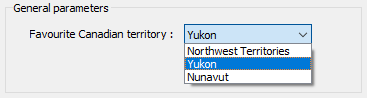

File form
---------

A file parameter comes with an icon to choose the file, with a ``str`` value.

"fileDescription"  ``str``
    Describes the type of file to filter.

"fileType" ``str``
    File extension to filter from. If multiple file types are given, the user will be able to select from a dropdown of the
    file types.

.. code-block:: json

    {
        "model_file": {
            "fileDescription": ["Chargeability", "Conductivity"],
            "fileType": ["chg", "con"],
            "label": "DC/IP model file",
            "value": ""
        }
    }

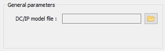

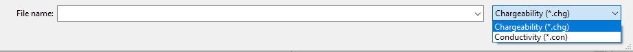

Group form
----------

The group parameter can be used to select groups within ANALYST.

"groupType" ``uuid`` or ``list[uuid]``
   A single entry or a list of known group types. A complete list of UUID's for geoh5  group types are available in the :ref:`geoh5 groups<geoh5_groups>` documentation page.

"multiSelect" ``bool``
    Option to allow selecting more than one group.

The value returned is the UUID of the ANALYST object selected, or a list of UUID's if many have been selected with the **multiSelect** option.

.. code-block:: json

    {
        "my_group": {
            "groupType": [
              "{61fbb4e8-a480-11e3-8d5a-2776bdf4f982}",
              "{55ed3daf-c192-4d4b-a439-60fa987fe2b8}"
            ],
            "multiSelect": false,
            "label": "Select Points or Curve",
            "value": ""
        }
    }

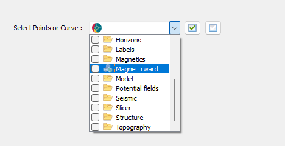

Drillhole Group data form
-------------------------

The Drillhole group data parameter allows users to select a drillhole group and one or more data channels from the group.

"groupType" ``uuid``
   Required type uuid of the drillhole group.

"groupValue" ``str``
    Name of the data group to filter data names from.

.. code-block:: json

    {
        "my_group_data": {
            "label": "Choose a drillhole group and data",
            "groupType": "{825424fb-c2c6-4fea-9f2b-6cd00023d393}",
            "groupValue": "",
            "multiselect": true,
            "value": ""
        }
    }

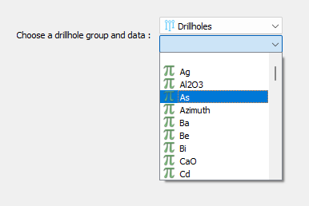

.. _object_form:

Object form
-----------

The object parameter allows users to select geoh5py objects from a dropdown in ANALYST.

"meshType" ``uuid`` or ``list[uuid]``
    A list of UUID of name of object type required to filter the :ref:`Object Type <object_types>` available in the dropdown. A complete list of UUID's for geoh5 object types are available in the :ref:`geoh5 objects<geoh5_objects>` documentation page.

"multiSelect" ``bool``
    Option to allow selecting more than one object.

The value returned is the uuid of the ANALYST object selected, or a list of uuids if many have been selected with the **multiSelect** option.

.. code-block:: json

    {
        "interesting_object": {
            "meshType": [
                "Points",
                "Curve"
            ],
            "multiSelect": false,
            "label": "Select Points or Curve",
            "value": ""
        }
    }

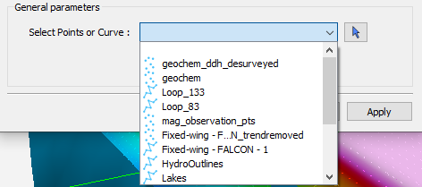

.. _data_form:

Data form
---------

Data selector from a parent object. The required fields are:

"dataType" ``str``
   Describes the type of data to filter. One or more (as an array) of these key words: ``Integer``, ``Float``, ``Text``,
   ``Referenced``, ``Vector``, ``DataTime``, ``Geometric`` or ``Boolean``.
"dataGroupType" (optional) ``str``
   To allow choosing a data group, the user can replace the **dataType** member with the **dataGroupType** and provide a
   single or array of the following strings ``3D vector``, ``Dip direction & dip``, ``Strike & dip``, or ``Multi-element``.
"association" ``str``
   Describes the geometry of the data. One or more of these key words: ``Vertex``, ``Cell``, or ``Face``.
"parent" ``str``
   Name of the parent (:ref:`Object form <object_form>`) to filter a list of data from.

.. code-block:: json

    {
        "data_mesh": {
            "meshType": [
                "{202C5DB1-A56D-4004-9CAD-BAAFD8899406}",
                "{6A057FDC-B355-11E3-95BE-FD84A7FFCB88}"
            ],
            "label": "Select Points or Curve",
            "value": ""
        },
        "data_channel": {
            "association": "Vertex",
            "dataType": "Float",
            "label": "Data channel",
            "parent": "data_mesh",
            "value": ""
        }
    }

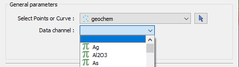

.. _data_value_form:

Data or value form
------------------
In some cases, a parameter may take its data from a object or simply a ``float`` value.

.. code-block:: json

    {
        "data_mesh": {
        "meshType": [
                "{202C5DB1-A56D-4004-9CAD-BAAFD8899406}",
                "{6A057FDC-B355-11E3-95BE-FD84A7FFCB88}"
            ],
            "label": "Select Points or Curve",
            "value": ""
        },
        "uncertainty_channel": {
            "association": "Vertex",
            "dataType": "Float",
            "isValue": true,
            "property": "",
            "min": 0.001,
            "label": "Uncertainty",
            "parent": "data_mesh",
            "value": 1.0
        }
    }

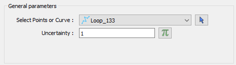

Users can switch between the **isValue** and **property** by clicking the :math:`\pi` icon. Just like the :ref:`Data form <data_form>` the **property** field depends on the **parent** object.

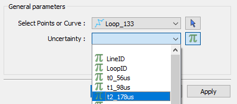

Range slider form
-----------------

The range slider parameter allows users to select a data channel and select a range of values from within the data bounds. The following fields are required:

"rangeLabel" ``str``
    Label for the range slider.

"allowComplement" ``bool``
    Boolean whether to allow the user to flip the inclusion from within the bounds to outside the bounds. The default is false.
"isComplement" ``bool``
    Boolean whether the range is currently set to include values within the bounds (**false**) or outside the bounds (**true**). The default is false.

Compared to the :ref:`Data or value <data_value_form>` form, the **property** will contain the uuid to the selected data, whereas the **value** will contain the range values.

.. code-block:: json

    {
        "my_object": {
            "label": "An object",
            "meshType": "{4ea87376-3ece-438b-bf12-3479733ded46}",
            "value": ""
        },
        "range_data": {
            "label": "Select range",
            "allowComplement": true,
            "isComplement": false,
            "parent": "my_object",
            "property": "",
            "association": "Cell",
            "dataType": "Float",
            "value": 0.0,
            "rangeLabel": "My range"
        }
    }

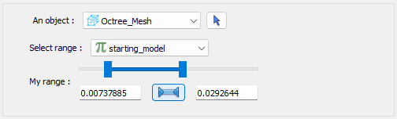
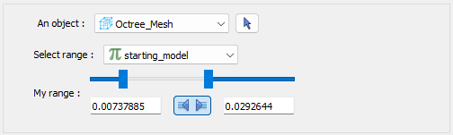

Dependencies
============

Additional customization of the UI can be achieved by creating dependencies between parameters. The following fields are available for all parameter types unless otherwise specified.

Form dependencies
-----------------

Forms can be enabled or disabled based on the value of another parameter. The parameter driving the dependency must contain an **optional** field or be a :ref:`Boolean parameter'<bool_param>`.

"dependency" ``str``
    Name of parameter that controls the enabled or visible state of the ui element.
"dependency_type" ``str``
    Either ``enabled`` or ``visible``.
    Controls whether the ui element is enabled or visible when the dependency is enabled if optional or True if a bool type.

.. code-block:: json

   {
        "python_interest": {
           "label": "Do you like Python?",
           "value": false,
           "tooltip": "Check if you like Python"
        },
        "favourite_package": {
            "label": "Favourite Python package",
            "value": "geoh5py",
            "dependency": "python_interest",
            "dependencyType": "enabled"
        }
   }

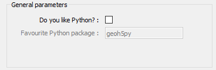

Groups
------

Forms can be grouped together to create a more organized UI. If set optional, the lead form of a group dictates the state of the group.

"group" ``str``
    Group name for UI elements. All forms within the group are rendered within a box labelled with the group name.
"groupOptional" ``bool``
    If True, UI group is rendered with a checkbox that controls the enabled state of all of the groups members. Only the first member of the group should have this member set to True.

.. code-block:: json

    {
        "data_mesh": {
            "meshType": [
                "{202C5DB1-A56D-4004-9CAD-BAAFD8899406}",
                "{6A057FDC-B355-11E3-95BE-FD84A7FFCB88}"
            ],
            "label": "Select Points or Curve",
            "value": "",
            "group": "Data selection",
            "groupOptional": true,
            "enabled": true
        },
        "data_channel": {
            "association": "Vertex",
            "dataType": "Float",
            "label": "Data channel",
            "parent": "data_mesh",
            "value": "",
            "group": "Data selection"
        }
    }

.. figure:: ./images/group_optional.png

Group dependencies
------------------

A group of UI elements can be enabled or disabled based on the state of a parameter outside the group. The parameter driving the dependency must contain an **optional** field or be a :ref:`Boolean parameter'<bool_param>`.

"groupDependency" ``str``
    Name of the form that controls the enabled or visible state of the ui group.
"groupDependencyType" ``str``
    Controls whether the ui group is ``enabled`` or ``disabled`` when the form dependency is enabled if optional or True if a bool type.

.. code-block:: json

    {
        "data_mesh": {
            "meshType": [
                "{202C5DB1-A56D-4004-9CAD-BAAFD8899406}",
                "{6A057FDC-B355-11E3-95BE-FD84A7FFCB88}"
            ],
            "label": "Select Points or Curve",
            "value": "",
            "optional": true,
            "main": true,
            "enabled": true
        },
        "data_channel": {
            "association": "Vertex",
            "dataType": "Float",
            "label": "Data channel",
            "parent": "data_mesh",
            "value": "",
            "main": true,
            "group": "Data selection"
        },
        "favourite_package": {
            "association": "Vertex",
            "dataType": "Float",
            "label": "Second channel",
            "parent": "data_mesh",
            "value": "",
            "group": "Data selection",
            "groupDependency": "data_mesh",
            "main": true,
            "enabled": false,
            "groupDependencyType": "enabled"
        }
    }

.. figure:: ./images/group_dependency.png

General Tips
^^^^^^^^^^^^
- Keep labels concise
- Write detailed tooltips
- Group related attributes
- Don't include the **main** member with every parameter. "Non-main" members are designated to a second page under *Optional parameters*
- Utilize **optional** object members and dependencies.
