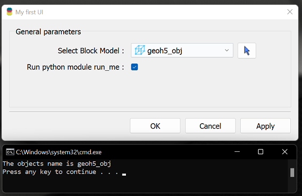

UI.JSON Format
==============

About
^^^^^

The **ui.json** format provides a schema to create a simple User Interface (UI) between geoh5py and `Geoscience ANALYST Pro
<http://www.mirageoscience.com/our-products/software-product/geoscience-analyst>`_. The format uses JSON objects to represent `script parameters <./json_objects.rst>`_ used in the UI, and pass those parameters to an accompanying python script.

Each ui.json object requires at least a **label** and **value** parameter, however additional parameters can be used to define different types of input (filepaths, geoh5py objects, strings etc.) and additional dependencies between script parameters.

For example, a simple ui.json below describes a single parameter called 'grid_object', which is used to select a block model.

.. code-block:: json

    {
    "grid_object": {
    "meshType": ["{B020A277-90E2-4CD7-84D6-612EE3F25051}"],
    "main": true,
    "label": "Select Block Model",
    "value": ""
    }
    }

Note the **meshType** used to select a geoh5py object, is defined by a list of their UUID. A complete list of UUID's for geoh5py object types are available in the `geoh5 objects documentation <../content/geoh5_format/analyst/objects.rst>`_.

Usage with Geoscience ANALYST Pro
^^^^^^^^^^^^^^^^^^^^^^^^^^^^^^^^^
A ui.json file shall contain the parameters that reference a python script to run, and an optional conda environment to use. Ensure the conda and python paths are set up in Geoscience ANALYST preferences.

run_command ``str``
    Name of python script excluding the .py extension (i.e., "run_me" for run_me.py) required for Geoscience ANALYST Pro to run on save or auto-load.
conda_environment ``str``
    Optional name of conda environment to activate when running the python script in *run_command*

To complete the example above with a python script to print out the name of a block model object, we will add the **run_command** parameter to the ui.json file. Within the accompanying python script, the parameters from the ui.json file is passed to the script as arguments, and can be accessed using the InputFile module of geoh5py as shown below:

.. code-block:: json

    {
    "grid_object": {
    "meshType": ["{B020A277-90E2-4CD7-84D6-612EE3F25051}"],
    "main": true,
    "label": "Select Block Model",
    "value": ""
    },
    "title":"My first UI",
    "run_command": "run_me"
    }

The following python code in the same directory as the ui.json file with the filename 'run_me.py' will be run.

.. code-block:: python

    import sys
    from geoh5py.ui_json import InputFile

    ui_json = sys.argv[1]
    ifile = InputFile.read_ui_json(ui_json)
    params = ifile.data

    # Get the block model grid object
    bm = params["grid_object"]
    print(f"The selected object name is {bm.name}")

When a **ui.json** is run within Geoscience ANALYST Pro, the following parameters are updated or added:

- The **value** member is updated with the UUID
- The **enabled** member ``bool`` for whether the parameter is enabled
- The :ref:`Data parameter <data_parameter>` will also have updated **isValue** and **property** members. The **isValue** ``bool`` member is *true* if the **value** member was selected and *false* if the **property** member was selected.

The following JSON objects will be written (and overwritten if given) upon running a ui.json from Geoscience ANALYST Pro:

- monitoring_directory ``str`` the absolute path of a monitoring directory. Workspace files written to this folder will be automatically processed by Geoscience ANALYST.
- workspace_geoh5 ``str`` the absolute path to the current workspace (if previously saved) being used
- geoh5 ``str`` the absolute path to the geoh5 written containing all the objects of the workspace within the parameters of the **ui.json**. One only needs to use this workspace along with the JSON file to access the objects with geoh5py.

Parameters available for all ui.json objects
^^^^^^^^^^^^^^^^^^^^^^^^^^^^^^^^^^^^^^^^^^^^
The following key/value pairs are available to all input parameters in the ui.json schema. The **label** and **value** keys required in each parameter. The other optional keys are used to describe how the UI will render and parameter dependancies.

label ``str``
    Required string describing parameter. A colon will automatically be added within Geoscience ANALYST, so this should be omitted.
value ``str``, ``int``, ``bool`` , or ``float``
    This required member takes a different form, including empty, depending on the :ref:`parameter type <json_param_examples>`. The value is updated when written from Geoscience ANALYST.
title ``str``
    Required Title of user interface window
main ``bool``
    If set to true, the parameter is shown in the first tab of the UI and will throw an error if not present (and not optional). Optional parameters may be set to main. When main is not given or is false, the parameter will be under the *Optional Parameters* tab.
tooltip ``str``
   String describing the parameter in detail that appears when the mouse hovers over it.
optional ``bool``
    *true* or *false* on whether the parameter is optional. On output, check if *enabled* is set to true.
enabled ``bool``
    *true* or *false* if the parameter is enabled. The default is true. If a parameter is optional and not enabled, it will start as disabled (grey and inactive in the UI).
group ``str``
    Name of the group to which the parameter belongs. Adds a box and name around the parameters with the same case-sensitive group name.
groupOptional ``bool``
    If true, adds a checkbox in the top of the group box next to the name. The group parameters will be disabled if not checked. The initial statedpends on the **groupDependency** and **groupDependencyType** members and the **enabled** member of the group's parameters.
dependency ``str``
    The name of the parameter which this parameter is dependent upon. The dependency parameter should be optional or boolean parameter (i.e., has a checkbox).
dependencyType ``str``
    What happens when the dependency member is checked. Options are ``enabled`` or ``disabled``
groupDependency ``str``
    The name of the object of which the group of the parameter is dependent upon. This member will also require the **groupOptional** member to be present and set to ``true``. Be sure that the object is not within the group.
groupDependencyType ``str``
    What happens when the group's dependency parameter is checked. Options are ``enabled`` or ``disabled``.

.. _json_param_examples:

Additional Parameters
^^^^^^^^^^^^^^^^^^^^^
The following sections define different object specific parameters that can be used in the **ui.json** schema.

 .. toctree::
   :maxdepth: 1

   json_objects.rst

Tips on creating UIs
^^^^^^^^^^^^^^^^^^^^
- Keep labels descriptive and concise
- Write detailed tooltips
- Group related attributes
- The **main** attribute is for general, required script variables. Do not include this member with every object, unless there are only a handful of objects. Objects that are in the required parameters without a valid value will invoke an error when exporting or running from Geoscience ANALYST. "Non-main" members are designated to a second page under *Optional parameters*.
- Utilize **optional** object members and dependencies. If a single workspace object input is optional, use the :ref:`Object parameter <object_parameter>` rather than two parameters with a dependency.

External Links
^^^^^^^^^^^^^^
- `JSON Objects <https://www.w3schools.com/js/js_json_objects.asp>`_
- `JSON Schema <https://json-schema.org/specification.html>`_
- `Universally Unique IDentifier (UUID) <https://en.wikipedia.org/wiki/Universally_unique_identifier>`_
