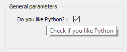
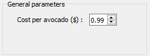
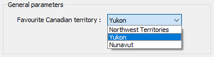
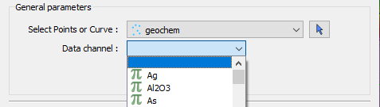

.. _bool_param:

Boolean parameter
=================

A parameter who has a ``bool`` value.

.. code-block:: json

   "python_interest": {
   "main": true,
   "label": "Do you like Python?",
   "value": true,
   "tooltip": "Check if you like Python"
   }

Integer parameter
=================

A parameter who has an ``int`` value. The optional paramaters ``min`` and ``max`` invoke a validator to insure the bound(s) are enforced.

.. code-block:: json

   "number_of_uis": {
   "main": true,
   "label": "Number of ui.json files have you created",
   "value": 1,
   "min": 0,
   "max": 100
   }

.. figure:: ./images/int_param.png
    :height: 100

Float parameter
===============

A parameter who has an ``float`` value. The optional paramaters are:

min ``float``
    Minimum value allowed for validator. The default is the minimum numeric limits of float.
max ``float``
    Maximum value allowed for validator. The default is the maximum numeric limits of float.
lineEdit ``bool``
    Boolean whether to use a line edit (**true**) or a spin box (**false**). The default is true.
precision ``int``
    Number of decimal places in the line edit or spin box

.. code-block:: json

   "cost_of_avocado": {
   "main": true,
   "label": "Cost per avocado ($)",
   "value": 0.99,
   "min": 0.29,
   "precision": 2,
   "lineEdit": false,
   "max": 2.79
   }

String parameter
================

For a simple string parameter, use an empty ``str`` value to have an empty string. Only a ``label`` and ``value`` is required.

.. code-block:: json

   "str_param": {
   "main": true,
   "label": "Name",
   "value": "Default answer"
   }

.. figure:: ./images/str_param.png
    :height: 100

Multi-choice string parameter
-----------------------------

For a drop-down of list of strings to choose, use a vector of ``str`` with the member ``choiceList``

.. code-block:: json

   "str_param": {
   "choiceList": ["Northwest Territories",
   "Yukon",
   "Nunavut"],
   "main": true,
   "label": "Favourite Canadian territory",
   "value": "Yukon"
   }

File parameter
==============

A file parameter comes with an icon to choose the file, with a ``str`` value. Extra members of the file object parameter are **fileDescription** and **fileType**. Both of these are ``str`` types and can be vectors, but must be of the same length

.. code-block:: json

   "model": {
   "fileDescription": ["Chargeability", "Conductivity"],
   "fileType": ["chg", "con"],
   "main": true,
   "label": "DC/IP model file",
   "value": ""
   }

.. figure:: ./images/file_param.png

.. figure:: ./images/file_choice.png

.. _object_parameter:

Object parameter
================

To choose an object from a dropdown menu, the *UUID* of the :ref:`Object Type <object_types>`: is required for the filtering of objects. This is given as a single or vector of ``str`` in the member **meshType**. The icon to pick the object comes with this parameter. The value returned is the *UUID* of the object selected.

.. code-block:: json

   "points_or_curves": {
   "meshType": ["{202C5DB1-A56D-4004-9CAD-BAAFD8899406}" ,
      "{6A057FDC-B355-11E3-95BE-FD84A7FFCB88}"],
   "main": true,
   "label": "Select Points or Curve",
   "value": ""
   }

.. figure:: ./images/object_param.png

.. _data_parameter:

Data parameter
==============

Creating a parameter to choose an object's data requires extra members:

dataType ``str``
   Describes the type of data to filter. One or more of these key words: ``Integer``, ``Float``, ``Text``, ``Referenced``, ``Vector``, ``DataTime``, ``Geometric``, ``Boolean``, or ``Text``
association ``str``
   Describes the geometry of the data. One or more of these key words: ``Vertex``, ``Cell``, or ``Face``
parent ``str``
   Either a *UUID* of the parent or the name of the :ref:`Object parameter <object_parameter>` json object to allow the user to choose the mesh.
isValue ``bool``
   Describes whether to read the **value** (``float``) or **property** (``str``) member. If not given, the value member is an *UUID* and is considered a *drop-down data parameter*. If this member is given along with **property**, then an icon changing from float to drop-down list will appear. Geoscience ANALYST Pro will update this value depending on the style choice (``float`` or ``str``)
property ``str``
   Data *UUID*  that is selected when **isValue** is present.  Geoscience ANALYST Pro will update this value on export.
min ``float``
    Optional minimum value allowed for the value. The default is the minimum numeric limits of float.
max ``float``
    Optional maximum value allowed for the value. The default is the maximum numeric limits of float.
precision ``int``
    Optional number of decimal places for the value.

Drop-down data parameter
------------------------
In this example, the object parameter *data_mesh* is also given for reference.

.. code-block:: json

   "data_channel": {
   "main": true,
   "association": "Vertex",
   "dataType": "Float",
   "label": "Data channel",
   "parent": "data_mesh",
   "value": ""
   },
   "data_mesh": {
   "main": true,
    "meshType": ["{202C5DB1-A56D-4004-9CAD-BAAFD8899406}" ,
      "{6A057FDC-B355-11E3-95BE-FD84A7FFCB88}"],
   "main": true,
   "label": "Select Points or Curve",
   "value": ""
   }

Data or value parameter
-----------------------
In some cases, a simple float will do. The use of the member **isValue** and **property** together allows the choice within the UI. In this example, the **property** member will turned on to begin with. The **value** will default to 1.0 and show up when the icon is clicked. The **uncertainty channel** object depends on the **data_mesh** object. The combobox will filter data from the chosen object that is located on the vertices and is float (pi icon).

.. code-block:: json

   "uncertainty_channel": {
   "main": true,
   "association": "Vertex",
   "dataType": "Float",
   "isValue": false,
   "property": "",
   "min": 0.001,
   "label": "Uncertainty",
   "parent": "data_mesh",
   "value": 1.0
   },
   "data_mesh": {
   "main": true,
    "meshType": ["{202C5DB1-A56D-4004-9CAD-BAAFD8899406}" ,
      "{6A057FDC-B355-11E3-95BE-FD84A7FFCB88}"],
   "main": true,
   "label": "Select Points or Curve",
   "value": ""
   }

.. figure:: ./images/data_value_param.png

Dependencies on other parameters
================================

Use the **dependency** and **dependencyType** members to create dependencies. The parameter driving the dependency should have the **optional** member or be a :ref:`Boolean parameter'<bool_param>`. Below are a couple of examples. The first requires the checkbox to be checked prior to the string parameter to be enabled. When the dependency is checked, the dependent parameter is *enabled*.

.. code-block:: json

   "python_interest": {
   "main": true,
   "label": "Do you like Python?",
   "value": false,
   "tooltip": "Check if you like Python"
   },
   "favourite_package": {
   "main": true,
   "label": "Favourite Python package",
   "value": "geoh5py",
   "dependency": "python_interest",
   "dependencyType": "enabled"
   }

.. figure:: ./images/dependency_ex1.png

The next example has a dependency on an optional parameter. The member *enabled* is set to false so that it is not automatically checked. This is a parameter that Geoscience ANALYST will update on export.

.. code-block:: json

   "territory": {
   "choiceList": ["Northwest Territories",
   "Yukon",
   "Nunavut"],
   "main": true,
   "label": "Favourite Canadian territory",
   "value": "Yukon",
   "optional": true,
   "enabled": false
   },
   "city": {
   "main": true,
   "choiceList": ["Yellowknife",
   "Whitehorse",
   "Iqaluit"],
   "label": "Favourite capital",
   "value": "",
   "dependency": "territory",
   "dependencyType": "enabled"
   }

.. figure:: ./images/dependency_ex2.png
.. figure:: ./images/dependency_ex3.png
