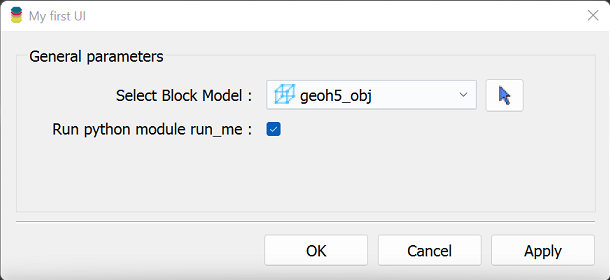
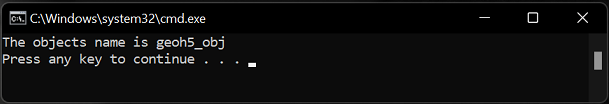

Usage
=====

A ui.json file contains the parameters that drive an accompanying Python script to be executed from Geoscience ANALYST.

To be valid, the **ui.json** file must contain at least the following members:

- **title** ``str``
    Title of user interface window
- **run_command** ``str``
    Name of python script excluding the .py extension (i.e., "run_me" for run_me.py) required for Geoscience ANALYST Pro
    to run on save or auto-load.
- **conda_environment** ``str``
    [Optional] Name of conda environment to activate when running the python script in *run_command*

For example, a simple ui.json below describes a single parameter called 'grid_object', which is used to select a block model within a geoh5 file.

.. code-block:: json

    {
    "grid_object": {
    "meshType": ["{B020A277-90E2-4CD7-84D6-612EE3F25051}"],
    "main": true,
    "label": "Select Block Model",
    "value": ""
    },
    "title":"My first UI",
    "run_command": "run_me",
    "conda_environment": "my_env"
    }

Note: The **meshType** used to select the grid object is defined by a list of UUID. A complete list of UUID's for geoh5
object types are available in the :ref:`geoh5 objects<geoh5_objects>` documentation page.

Within the accompanying python script, the parameters from the ui.json may be accessed using the InputFile module of
geoh5py as shown below:

.. code-block:: python

    import sys
    from geoh5py.ui_json import InputFile

    ui_json = sys.argv[1]
    ifile = InputFile.read_ui_json(ui_json)
    params = ifile.data

    # Get the block model grid object
    bm = params["grid_object"]
    print(f"The selected object name is {bm.name}")

Rendering
^^^^^^^^^

The user interface defined by the ``ui.json`` file can be opened in ANALYST Pro in two ways:

a. **Drag and Drop:**
   Simply drag the ``ui.json`` file into the viewport. The corresponding dialog will open immediately.

   .. figure:: ./images/drag_drop.gif
      :align: center
      :width: 800

b. **Add to Python Script Menu:**

   1. From the ANALYST menubar, open the *Python* menu and select *Script Directory* to launch the file explorer.

   2. Copy the ``ui.json`` file into the displayed folder.

   3. Close the workspace or restart ANALYST Pro. The new application will appear under the Python script menu.

   .. figure:: ./images/dropdown.gif
      :align: center
      :width: 800

Execution
^^^^^^^^^

When a **ui.json** is run within Geoscience ANALYST Pro, the following parameters are updated or added:

- The **value** member of the ``grid_object`` parameter is updated with the UUID of the object selected in the UI.
- The **enabled** member of the ``grid_object`` is set for whether the parameter is enabled. The **enabled** state can be
  modified by making the parameter (group) **optional** or a (group) **dependency** of another parameter (group).
- The **isValue** and **property** members of any :ref:`Data parameter <data_parameter>` are also updated . The **isValue** member
  is *true* if the **value** member was selected and ``false`` if the **property** member was selected.

The following JSON objects will be written (and overwritten if given) upon running a ui.json from Geoscience ANALYST Pro:

- The **monitoring_directory** ``str`` the absolute path of a monitoring directory. Workspace files written to this folder
  will be automatically processed by Geoscience ANALYST.
- The **workspace_geoh5** ``str`` (Optional) Path to the source geoh5 file (for reference only)
- The **geoh5** ``str`` the absolute path to the geoh5 written containing all the objects of the workspace within the
  parameters of the **ui.json**. One only needs to use this workspace along with the JSON file to access the objects
  with geoh5py.

General Tips
^^^^^^^^^^^^
- Keep labels concise
- Write detailed tooltips
- Group related attributes
- Don't include the **main** member with every parameter. "Non-main" members are designated to a second page under *Optional parameters*
- Utilize **optional** object members and dependencies.
