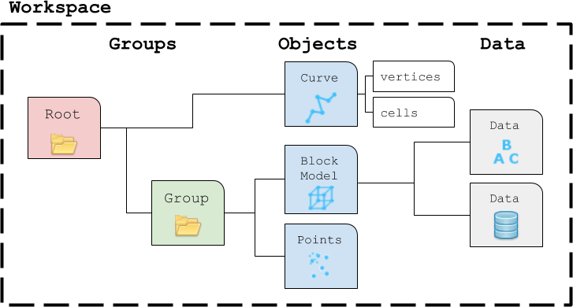

User Guide
==========

This section provides information on how to use the **geoh5py** package, from
the creation of a Workspace_ to the creation and manipulation of objects and data.

.. toctree::
   :maxdepth: 1

   workspace
   groups
   objects
   surveys
   data

.. _Workspace: workspace.ipynb
