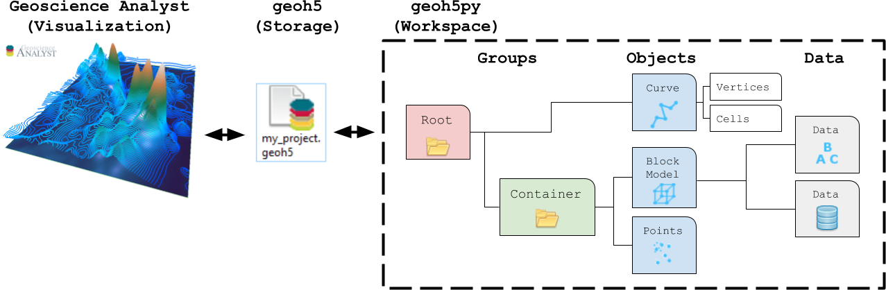

Surveys
=======

This section provides information on how to create geophysical surveys programmatically.

.. toctree::
   :maxdepth: 1

   airborne_tem.ipynb
   direct_current.ipynb
   magnetotelluric.ipynb
   tipper.ipynb
