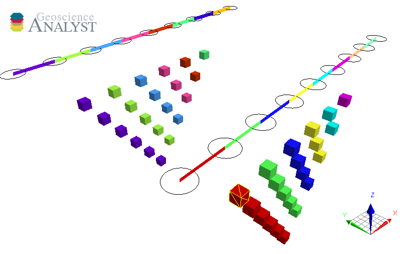

Surveys
=======

This section provides information on how to create geophysical surveys programmatically.

.. toctree::
   :maxdepth: 2

   airborne_tem
   direct_current
   magnetotelluric
   tipper
