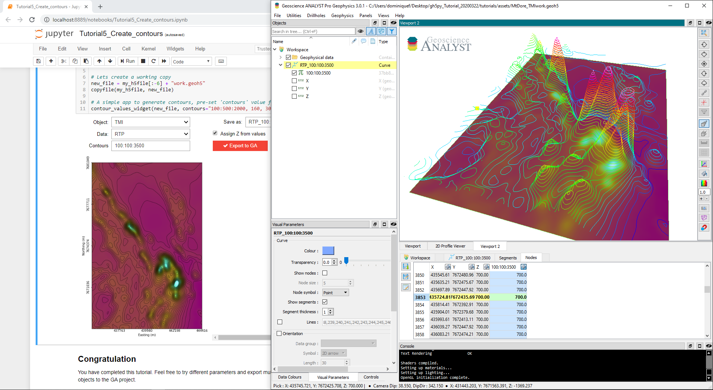

About
=====

Welcome to the documentation page for **geoh5py**.

This library has been created for the manipulation and storage of a wide range of
geoscientific data (points, curve, surface, 2D and 3D grids) in
`geoh5 file format <https://gist.github.com/jincandescent/06a3bd4e0e54360ad191>`_.
Users are able to directly leverage the powerful visualization
capabilities of `Geoscience ANALYST <https://mirageoscience.com/mining-industry-software/geoscience-analyst/>`_ along with open-source code from the Python ecosystem.

License
^^^^^^^
|copyright_notice|

geoh5py is free software: you can redistribute it and/or modify
it under the terms of the GNU Lesser General Public License as published by
the Free Software Foundation, either version 3 of the License, or
(at your option) any later version.

geoh5py is distributed in the hope that it will be useful,
but WITHOUT ANY WARRANTY; without even the implied warranty of
MERCHANTABILITY or FITNESS FOR A PARTICULAR PURPOSE.  See the
GNU Lesser General Public License for more details.

You should have received a copy of the GNU Lesser General Public License
along with geoh5py.  If not, see <https://www.gnu.org/licenses/>.

Third Party Software
^^^^^^^^^^^^^^^^^^^^
The geoh5 Software may provide links to third party libraries or code (collectively "Third Party Software")
to implement various functions. Third Party Software does not comprise part of the Software.
The use of Third Party Software is governed by the terms of such software license(s).
Third Party Software notices and/or additional terms and conditions are located in the
`THIRD_PARTY_SOFTWARE.rst`_ file.

.. _THIRD_PARTY_SOFTWARE.rst: THIRD_PARTY_SOFTWARE.rst

Citing
^^^^^^

If you use **geoh5py** in your research, please cite it as follows:

.. image:: https://zenodo.org/badge/207860560.svg
   :target: https://zenodo.org/badge/latestdoi/207860560

Feedback
^^^^^^^^

Have comments or suggestions? Submit feedback.
All the content can be found on our github_ repository.

.. _github: https://github.com/MiraGeoscience/geoh5py
